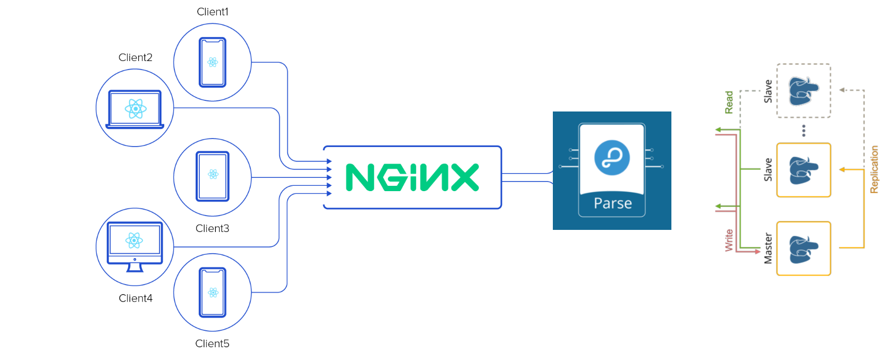

# BOOK STORE
In this project we design an online book store website. In the backend we use [Parse srever](https://parseplatform.org/) and in the frontend [React](https://reactjs.org/) was used. 

As we can see from the above picture we used [Nginx](https://www.nginx.com/) as a load balancer and a reverse proxy, and also we have tow postgres databases. The master postgres responsible for write and read and the slave database is used for read and the data. In order to prevent data inconsistency master database sync salve database data. but as we have two database for read data we can distribute request between master and slave.

## ویژگی ها
در صفحه لیتسی از پر طرفدار ترین کتاب ها نمایش داده می‌شود که هر کتاب دارای صفحه مخصوص خود است. در صفحه اول و در روی هر یک از کتاب ها ما اسم نویسنده اسم کتاب، اسم ناشر و خلاصه‌ای از آن کتاب را قرار می‌دهیم.

علاوه بر این برای هر محصول یک صفحه اختصاصی وجود دارد که کاربر پس از وارد شدن به آن آدرس می‌تواند آن کتاب را در صورتی که از پیش ثبت نام کرده باشد و یا هم اکنون ثبت نام کرده باشد به سبد خرید خود اضافه کند.

در کنار این دو دسته بندی بر اساس ژانرها و نویسندگان وجود دارد که در هر کدام ما تمام ژانرها و نویسندگان را نمایش می‌دهیم و کاربر می‌تواند بر اساس ژانر و یا نویسنده مورد علاقه خود کتاب ها را فیلتر کند.

دیگر ویژگی این سایت داشتن یک ادمین پنل است که به صورت دیافت یک یوزر با نام کاربری و رمز admin دارد و این یوزر می‌تواند موجودی کتاب ها را تغییر دهد و ژانر ها و نویسندگان جدید را اضافه‌کند و یا عکس یا بقیه مشخصات ژانر ها را آپدیت کند.

علاوه بر ادمین پنل خود کاربران نیز بعد از وارد شدن وارد داشبودر خود می‌شوند و از آنجا می‌توانند سبد خرید های خود را ببینند و رمز خود را تغییر دهند.

همچنین سه سطح دسترسی برای کاربران تعیین شده است که عبارتند از : Admin , Authenticatied, Guest است. این سه سطخ از دسترسی به ترتیب از بیشترین به کمترین دسترسی را دارا هستند نقش ادمین می‌تواند کتاب های جدید درست کند و یا مولف ها یا ژانر های جدید را بی‌افزاید.
کاربرانی که Authenticatied هستند می‌توانند کتاب به سبد خرید خود اضافه کنند یا خرید کنند.
Guest ها کمترین دسترسی را دارند و فقط می‌توانند اطلاعات کتاب را مشاهده کنند و درصورت درخواست برای اضافه شدن به سبد خرید باید ابتدا ثبت‌نام کنند یا وارد شوند.
